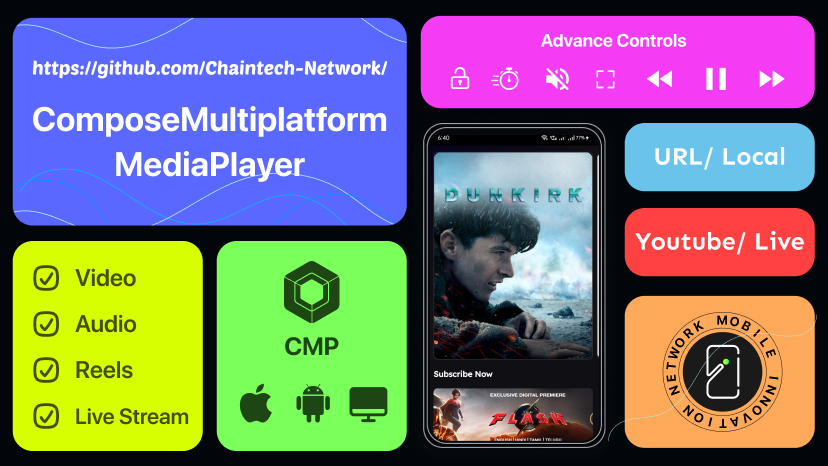

# Compose Multiplatform Media Player
[](https://central.sonatype.com/artifact/network.chaintech/compose-multiplatform-media-player)
[](http://kotlinlang.org)
[](https://github.com/JetBrains/compose-multiplatform)
[](http://www.apache.org/licenses/LICENSE-2.0)


Compose Multiplatform Media Player is a powerful media player library designed for Compose Multiplatform projects. It enables seamless video player, reels viewing, audio playing, YouTube video integration, video preview thumbnails and HLS m3u8 support on iOS, Android, and Desktop platforms. The library offers extensive customization options for various controls, making it flexible for different types of media applications.




## ✨ Features
**Cross-Platform Compatibility:** Works seamlessly on iOS, Android, and Desktop platforms within Compose Multiplatform projects.

**Video Player:** Effortlessly play videos in your app with high performance and reliability.

**HLS m3u8 Playback:** Seamlessly stream live and on-demand content with HLS (.m3u8), featuring quality, caption, and audio track selection for a customizable viewing experience.

**YouTube Player:** Integrate YouTube videos directly into your app, with full control over playback and video state management.

**Reel Viewing:** Enjoy reel viewing with support for horizontal and vertical scrolling.

**Audio Player:** Enjoy high-quality audio playback with customizable controls.

**Video Preview:** Display animated video previews for a more engaging experience.

**Customizable Controls:** Enable/disable pause/resume functionality and adjust the appearance and visibility of the seek bar, along with various control icons and colors.

**Resume Video Playback:**  Automatically resume video playback from the last position.


## 📦 Installation

Add the following dependency to your `build.gradle.kts` file:

```kotlin
commonMain.dependencies {
    implementation("network.chaintech:compose-multiplatform-media-player:1.0.39")
}
```
💡 **Note:** For desktop video player, ensure VLC Player is installed, and for desktop YouTube support, Java must be installed on your system.

## 📦 Setup for Resuming Video Playback
If you want to enable the feature to resume video playback from the last saved position, you need to initialize PlaybackPreference in your Android app. Add the following setup in your AppActivity:

```kotlin
class AppActivity : ComponentActivity() {
    override fun onCreate(savedInstanceState: Bundle?) {
        super.onCreate(savedInstanceState)
        PlaybackPreference.initialize(this)
    }
}
```
This ensures that playback positions are properly saved and retrieved when needed. Without this initialization, the resume feature will not work on Android. 🚀

## 🎬 Usage

## MediaPlayerHost Class
### Constructor Parameters
* **mediaUrl (String):** The URL of the media to be played.
* **isPaused (Boolean):** Sets the initial playback state. Defaults to false (play on load).
* **isMuted (Boolean):** Indicates whether the video is muted initially. Defaults to false.
* **initialSpeed (PlayerSpeed):** Sets the initial playback speed. Defaults to PlayerSpeed.X1.
* **initialVideoFitMode (ScreenResize):** Specifies the video resizing mode. Defaults to ScreenResize.FILL.
* **isLooping (Boolean):** Enables or disables looping. Defaults to true.
* **startTimeInSeconds (Float?):** Optionally specifies the start time (in seconds) for the video. Defaults to null.
* **isFullScreen (Boolean):** Enables or disables full screen. Defaults to false.
* **headers (Map<String, String>?):** Optional HTTP headers to be sent with the media request. Defaults to null.
* **drmConfig (DrmConfig?):** Optional DRM configuration for protected content. Defaults to null. Supports ClearKey Encryption DRM for playing encrypted media.

### Available Controls
* **loadUrl(mediaUrl: String, headers: Map<String, String>? = null, drmConfig: DrmConfig? = null):** Updates the media URL to load a new media. Optionally, you can pass HTTP headers and DRM configuration
* **play():** Resumes media playback.
* **pause():** Pauses media playback.
* **togglePlayPause():** Toggles between play and pause states.
* **mute():** Mutes the video.
* **unmute():** Unmutes the video.
* **toggleMuteUnmute():** Toggles between muted and unmuted states.
* **setSpeed(speed: PlayerSpeed):** Adjusts the playback speed.
* **seekTo(seconds: Float?):** Seeks to a specific time in the media.
* **setVideoFitMode(mode: ScreenResize):** Updates the video resizing mode.
* **setLooping(isLooping: Boolean):** Enables or disables looping.
* **toggleLoop():** Toggles loop state.
* **setVolume(level: Float):** Adjusts the volume. Value must be between 0.0 and 1.0.
* **setFullScreen(isFullScreen: Boolean):** Enables or disables full screen.
* **toggleFullScreen():** Toggles full screen enable/disable states.

### Internal Updates and Events
The MediaPlayerHost class manages internal state changes and triggers events via the onEvent callback. These events allow developers to monitor and respond to changes in the media player state:

| Event                                   | Description                                                                     |
|-----------------------------------------|---------------------------------------------------------------------------------|
| PauseChange(isPaused: Boolean)          | Triggered when the playback state changes (play or pause).                      |
| MuteChange(isMuted: Boolean)            | Triggered when the mute state changes (mute or unmute).                         |
| BufferChange(isBuffering: Boolean)      | Triggered when the buffering state changes (e.g., when buffering starts/stops). |
| TotalTimeChange(totalTime: Int)         | Triggered when the total duration of the video updates.                         |
| CurrentTimeChange(currentTime: Int)     | Triggered when the current playback position updates.                           |
| FullScreenChange(isFullScreen: Boolean) | Triggered when the full screen state changes.                                   |
| MediaEnd                                | Triggered when the media playback completes.                                    |

### Error Handling
The MediaPlayerHost class provides an onError callback to handle various errors that may occur during media playback.

| Error Type                           | Description                                                                  |
|--------------------------------------|------------------------------------------------------------------------------|
| VlcNotFound                          | Triggered when the VLC library is not found, preventing playback in Desktop. |
| InitializationError(details: String) | Occurs if the media player fails to initialize properly.                     |
| PlaybackError(details: String)       | Triggered when an error occurs during media playback                         |
| ResourceError(details: String)       | Occurs when the media resource is unavailable or cannot be loaded.           |

### Example Usage
```kotlin
val videoPlayerHost = MediaPlayerHost(
    mediaUrl = "https://example.com/video.mp4",
    isPaused = true,
    isMuted = false,
    initialSpeed = PlayerSpeed.X1,
    initialVideoFitMode = ScreenResize.FIT,
    isLooping = false,
    startTimeInSeconds = 10f,
    isFullScreen = true
)

// Play the video
videoPlayerHost.play()

// Pause the video
videoPlayerHost.pause()

// Toggle mute
videoPlayerHost.toggleMuteUnmute()

// Seek to 30 seconds
videoPlayerHost.seekTo(30f)

// Change playback speed to 1.5x
videoPlayerHost.setSpeed(PlayerSpeed.X1_5)

// Enable looping
videoPlayerHost.setLooping(true)

// Enable Full screen
videoPlayerHost.setFullScreen(true)

videoPlayerHost.onEvent = { event ->
    when (event) {
        is MediaPlayerEvent.MuteChange -> { println("Mute status changed: ${event.isMuted}") }
        is MediaPlayerEvent.PauseChange -> { println("Pause status changed: ${event.isPaused}") }
        is MediaPlayerEvent.BufferChange -> { println("Buffering status: ${event.isBuffering}") }
        is MediaPlayerEvent.CurrentTimeChange -> { println("Current playback time: ${event.currentTime}s") }
        is MediaPlayerEvent.TotalTimeChange -> { println("Video duration updated: ${event.totalTime}s") }
        is MediaPlayerEvent.FullScreenChange -> { println("FullScreen status changed: ${event.isFullScreen}") }
        MediaPlayerEvent.MediaEnd -> { println("Video playback ended") }
    }
}

videoPlayerHost.onError = { error ->
    when(error) {
        is MediaPlayerError.VlcNotFound -> { println("Error: VLC library not found. Please ensure VLC is installed.") }
        is MediaPlayerError.InitializationError -> { println("Initialization Error: ${error.details}") }
        is MediaPlayerError.PlaybackError -> { println("Playback Error: ${error.details}") }
        is MediaPlayerError.ResourceError -> { println("Resource Error: ${error.details}") }
    }
}
```

### 📹 Video Player
To play videos in your app, use the VideoPlayerComposable:
```kotlin
val playerHost = remember { MediaPlayerHost(mediaUrl = url) }

VideoPlayerComposable(
    modifier = Modifier.fillMaxSize(),
    playerHost = playerHost
)
```
💡 **Note:** The VideoPlayerComposable supports both online and local video playback. You can provide a URL for a remote video or a local file path.

### 📹 Video Preview
To display video preview thumbnails, use the VideoPreviewComposable:
```kotlin
VideoPreviewComposable(
    url = videoUrl,
    frameCount = 5,
    contentScale = ContentScale.Crop
)
```
💡 **Note:** The VideoPreviewComposable does not support local asset video in Android.

### ▶️ YouTube Player
To play youtube videos in your app, use the YouTubePlayerComposable:
```kotlin
val playerHost = remember { MediaPlayerHost(mediaUrl = youtubeVideoId) }

YouTubePlayerComposable(
    modifier = Modifier.fillMaxSize(),
    playerHost = playerHost
)
```
💡 **Note:** The YouTubePlayerComposable supports both YouTube video URLs and video IDs. It automatically extracts the video ID if a full URL is provided, ensuring seamless playback.

### 🎥 Reel Viewing
For reel viewing, utilize the ReelsPlayerComposable:
```kotlin
ReelsPlayerComposable(
    modifier = Modifier.fillMaxSize(),
    urls = videoUrlArray
)
```

### 🎧 Audio Player
To play audio in your app, use `AudioPlayerComposable` for a built-in UI experience or `AudioPlayer` for a fully customizable, independent player. 🎵
```kotlin
val playerHost = remember { MediaPlayerHost(mediaUrl = url) }
AudioPlayerComposable(
    modifier = Modifier,
    audios = audioFilesArray,
    playerHost = playerHost,
)

//Independent player
AudioPlayer(
    playerHost = playerHost
)

```
💡 **Note:** The AudioPlayerComposable supports both online and local audio playback. You can provide a URL for a remote audio file or a local file path.

### 📏 Retrieve Media Duration
To retrieve the duration of a media file, use the RetrieveMediaDuration function:
```kotlin
RetrieveMediaDuration(
    url = videoUrl,
    onDurationRetrieved = { duration ->
        // Handle the retrieved duration (in seconds)
    }
)
```
This function asynchronously fetches the total duration of the media file from the provided URL and returns it via the onDurationRetrieved callback.

## ⚙️ Customization
You can customize various aspects of the media player:

* `modifier`: Modifies the layout and appearance of the video player and reel player.
* `playerHost`: The VideoPlayerHost class manages internal state changes of video player.
* `urls`: An array of URLs for the reel player, allowing playback of multiple reels.
* `playerConfig`: You can configure various aspects of the video player appearance using the VideoPlayerConfig data class.

| Property                                              | Description                                                                                                      |
|-------------------------------------------------------|------------------------------------------------------------------------------------------------------------------|
| showControls                                          | Hide/Show video player inbuilt controls.                                                                         |
| isPauseResumeEnabled                                  | Enable or disable the pause/resume functionality.                                                                |
| isSeekBarVisible                                      | Toggle the visibility of the seek bar.                                                                           |
| isDurationVisible                                     | Control the display of the playback time duration.                                                               |
| seekBarThumbColor                                     | Sets the color of the seek bar thumb.                                                                            |
| seekBarActiveTrackColor                               | Sets the color of the played portion of the track.                                                               |
| seekBarInactiveTrackColor                             | Sets the color of the unplayed portion of the track.                                                             |
| seekBarThumbRadius                                    | Adjusts the size of the seek bar thumb.                                                                          |
| seekBarTrackHeight                                    | Adjusts the height of the seek bar track.                                                                        |
| durationTextColor                                     | Customize the color of the duration text displayed alongside the seek bar.                                       |
| durationTextStyle                                     | Customize the text style of the duration text, including font size and weight.                                   |
| seekBarBottomPadding                                  | Configure the bottom padding for the seek bar control, ensuring proper alignment within the UI layout.           |
| seekBarBottomPaddingInFullScreen                      | Configure the bottom padding for the seek bar control at the time of fullscreen.                                 |
| playIconResource & pauseIconResource                  | Customize the play and pause button icons.                                                                       |
| pauseResumeIconSize                                   | Customize the size of the pause/resume icons.                                                                    |
| reelVerticalScrolling                                 | Manage vertical and horizontal scrolling in reel viewing.                                                        |
| isAutoHideControlEnabled & controlHideIntervalSeconds | Enable the automatic hiding of controls after a specified time interval (in seconds).                            |
| isFastForwardBackwardEnabled                          | Enable or disable fast forward and backward controls.                                                            |
| fastForwardBackwardIconSize                           | Customize the size of the fast forward/backward icons.                                                           |
| fastForwardIconResource & fastBackwardIconResource    | Customize the icons for fast forward and fast backward controls.                                                 |
| fastForwardBackwardIntervalSeconds                    | Set the interval (in seconds) for fast forward and backward actions.                                             |
| isMuteControlEnabled                                  | Enable or disable mute control functionality.                                                                    |
| unMuteIconResource & muteIconResource                 | Customize the icons for unmute and mute controls.                                                                |
| topControlSize                                        | Customize the size of the top control buttons.                                                                   |
| isSpeedControlEnabled                                 | Enable or disable speed control functionality.                                                                   |
| speedIconResource                                     | Customize the icon for speed control.                                                                            |
| isFullScreenEnabled                                   | Enable or disable full-screen functionality.                                                                     |
| controlTopPadding                                     | Configure the top padding for controls, ensuring proper alignment within the UI layout.                          |
| isScreenLockEnabled                                   | Enable or disable screen lock functionality.                                                                     |
| iconsTintColor                                        | Customize the tint color of the control icons.                                                                   |
| isScreenResizeEnabled                                 | Enable or disable screen resize (Fit/Fill) functionality.                                                        |
| loadingIndicatorColor                                 | Customize the color of the loading indicator.                                                                    |
| loaderView                                            | Custom loader for showing loading state.                                                                         |
| isLiveStream                                          | A boolean property that indicates whether the currently playing video is a live stream.                          |
| controlClickAnimationDuration                         | Duration (in milliseconds) of the click animation applied to a button or control when the user interacts with it |
| backdropAlpha                                         | Controls the transparency of the backdrop beneath the media controls.                                            |
| autoPlayNextReel                                      | Automatically plays the next reel when the current one ends.                                                     |
| enableResumePlayback                                  | Resume from last saved position.                                                                                 |
| isZoomEnabled                                         | Enables or disables zoom functionality. Defaults to true.                                                        |
| isGestureVolumeControlEnabled                         | Allows to control volume level by using vertical drag gesture on right side of player                            |
| showVideoQualityOptions                               | Lets users select from available video resolutions.                                                              |                                                                                        |
| showAudioTracksOptions                                | Lets users switch between available audio tracks.                                                                | 
| showSubTitlesOptions                                  | Lets users choose from available subtitles.                                                                      |
| watermarkConfig                                       | Allows adding a dynamic watermark that moves within video bounds with customizable content and timing.           |
| chapters                                              | Shows chapter points on the SeekBar with titles.                                                                 |
| enableFullEdgeToEdge                                  | Uses immersive full-screen mode that extends content into system and cutout areas                                |
| enableBackButton                                      | Shows a back button at the top-left corner when true                                                             |
| backIconResource                                      | Custom icon for the back button (`DrawableResource`)                                                             |
| backActionCallback                                    | Callback triggered when back button is tapped                                                                    |

* `audioPlayerConfig`: You can configure various aspects of the audio player appearance and behavior using the AudioPlayerConfig data class.
  
| Property                                       | Description                                                                                                      |
|------------------------------------------------|------------------------------------------------------------------------------------------------------------------|
| showControl                                    | Toggle to show or hide the AudioPlayer UI for a customizable playback experience.                                |
| isControlsVisible                              | Toggle the visibility of the player controls.                                                                    |
| backgroundColor                                | Customize the background color of the audio player.                                                              |
| coverBackground                                | Customize the background color of the cover image.                                                               |
| seekBarThumbColor                              | Sets the color of the seek bar thumb.                                                                            | 
| seekBarActiveTrackColor                        | Sets the color of the played portion of the track.                                                               | 
| seekBarInactiveTrackColor                      | Sets the color of the unplayed portion of the track.                                                             | 
| seekBarThumbRadius                             | Adjusts the size of the seek bar thumb.                                                                          | 
| seekBarTrackHeight                             | Adjusts the height of the seek bar track.                                                                        | 
| fontColor                                      | Customize the color of the text used in the player.                                                              |
| durationTextStyle                              | Customize the text style of the duration text, including font size and weight.                                   |
| titleTextStyle                                 | Customize the text style of the title text, including font size and weight.                                      |
| controlsBottomPadding                          | Configure the bottom padding for the controls, ensuring proper alignment within the UI layout.                   |
| playIconResource & pauseIconResource           | Customize the play and pause button icons.                                                                       |
| pauseResumeIconSize                            | Customize the size of the pause/resume icons.                                                                    |
| previousNextIconSize                           | Customize the size of the previous and next track icons.                                                         |
| previousIconResource & nextIconResource        | Customize the icons for the previous and next track controls.                                                    |
| iconsTintColor                                 | Customize the tint color of the control icons.                                                                   |
| loadingIndicatorColor                          | Customize the color of the loading indicator.                                                                    |
| shuffleOnIconResource & shuffleOffIconResource | Customize the icons for the shuffle control when enabled and disabled.                                           |
| advanceControlIconSize                         | Customize the size of the advance control icons (e.g., fast forward/backward).                                   |
| repeatOnIconResource & repeatOffIconResource   | Customize the icons for the repeat control when enabled and disabled.                                            |
| controlClickAnimationDuration                  | Duration (in milliseconds) of the click animation applied to a button or control when the user interacts with it |

```kotlin
val playerHost = remember { MediaPlayerHost(mediaUrl = videoUrl) }

VideoPlayerComposable(modifier = Modifier.fillMaxSize(),
                playerHost = playerHost,
                playerConfig = VideoPlayerConfig(
                    isPauseResumeEnabled = true,
                    isSeekBarVisible = true,
                    isDurationVisible = true,
                    seekBarThumbColor = Color.Red,
                    seekBarActiveTrackColor = Color.Red,
                    seekBarInactiveTrackColor = Color.White,
                    durationTextColor = Color.White,
                    seekBarBottomPadding = 10.dp,
                    pauseResumeIconSize = 40.dp,
                    isAutoHideControlEnabled = true,
                    controlHideIntervalSeconds = 5,
                    isFastForwardBackwardEnabled = true,
                    playIconResource = Res.drawable.icn_play,
                    pauseIconResource = Res.drawable.icn_pause,
                )
            )
```

```kotlin
VideoPreviewComposable(
    url = videoUrl,
    loadingIndicatorColor = Color.White,
    frameCount = 5
)
```

```kotlin
val playerHost = remember { MediaPlayerHost(mediaUrl = "QFxN2oDKk0E") }

YouTubePlayerComposable(modifier = Modifier.fillMaxSize(),
                playerHost = playerHost,
                playerConfig = VideoPlayerConfig(
                    isPauseResumeEnabled = true,
                    isSeekBarVisible = true,
                    isDurationVisible = true,
                    seekBarThumbColor = Color.Red,
                    seekBarActiveTrackColor = Color.Red,
                    seekBarInactiveTrackColor = Color.White,
                    durationTextColor = Color.White,
                    seekBarBottomPadding = 10.dp,
                    pauseResumeIconSize = 40.dp,
                    isAutoHideControlEnabled = true,
                    controlHideIntervalSeconds = 5,
                    isFastForwardBackwardEnabled = true,
                    playIconResource = Res.drawable.icn_play,
                    pauseIconResource = Res.drawable.icn_pause,
                )
            )
```


```kotlin
ReelsPlayerComposable(modifier = Modifier.fillMaxSize(),
        urls = videoUrlArray,
        playerConfig = VideoPlayerConfig(
            isPauseResumeEnabled = true,
            isSeekBarVisible = false,
            isDurationVisible = false,
            isMuteControlEnabled = false,
            isSpeedControlEnabled = false,
            isFullScreenEnabled = false,
            isScreenLockEnabled = false,
            reelVerticalScrolling = true
        ),
        currentItemIndex = { /* Current Reel Index */ }
    )
```

```kotlin
val audioFilesArray = listOf(
        AudioFile(
            audioUrl = "https://codeskulptor-demos.commondatastorage.googleapis.com/GalaxyInvaders/theme_01.mp3",
            audioTitle = "Galaxy Invaders",
            thumbnailUrl = "https://c.saavncdn.com/866/On-My-Way-English-2019-20190308195918-500x500.jpg"
        ),
        AudioFile(
            audioUrl = "https://codeskulptor-demos.commondatastorage.googleapis.com/pang/paza-moduless.mp3",
            audioTitle = "Paza Moduless"
        )
    )

val playerHost = remember { MediaPlayerHost(mediaUrl = audioFilesArray.first().audioUrl) }

AudioPlayerComposable(
        modifier = Modifier,
        audios = audioFilesArray,
        playerHost = playerHost,
        audioPlayerConfig = AudioPlayerConfig(
            isControlsVisible = true,
            fontColor = Color.White,
            iconsTintColor = Color.White
        ),
        currentItemIndex = { /* Current Audio File Index */ }
    )
```

## 📀 Format Support
|  Format  | Android  |   iOS    | Desktop  |
|:--------:|:--------:|:--------:|:--------:|
|   MP4    |    ✅     |    ✅     |    ✅     |
|   MOV    |    ✅     |    ✅     |    ✅     |
|   3GP    |    ✅     |    ✅     |    ✅     |
|   AVI    |    ✅     |    ❌     |    ✅     |
|   MKV    |    ✅     |    ❌     |    ✅     |
|   WEBM   |    ✅     |    ❌     |    ✅     |
|   MTS    |    ✅     |    ❌     |    ✅     |
|   m3u8   |    ✅     |    ✅     |    ✅     |
|   MP3    |    ✅     |    ✅     |    ✅     |
|   FLAC   |    ✅     |    ✅     |    ✅     |
|   WAV    |    ✅     |    ✅     |    ✅     |
|   AAC    |    ✅     |    ❌     |    ✅     |
|   AIF    |    ❌     |    ✅     |    ✅     |
|   ALAC   |    ✅     |    ❌     |    ✅     |
|   OGG    |    ✅     |    ❌     |    ✅     |
| YouTube  |    ✅     |    ✅     |    ✅     |

## 📖 Detailed Explanation
For an in-depth guide and detailed explanation, check out our comprehensive Medium Blog Post.

[](https://medium.com/mobile-innovation-network/introducing-compose-multiplatform-media-player-your-go-to-solution-for-seamless-media-playback-691df3cc4da9)  
[](https://www.linkedin.com/showcase/mobile-innovation-network)

## 🛤️ Roadmap
We're committed to continuously improving and expanding the capabilities of our media player library. Here's a glimpse into our future plans:

### 🌟 Upcoming Features
- Picture-in-Picture (PiP) Mode
- Video Caching for iOS & Desktop
- Clear key encryption for iOS & Desktop
- WasmJs support

## 🛠️ Libraries Used in Demo
The demo project utilizes the following libraries:

**SDP & SSP for Compose Multiplatform** – Scalable size units for responsive UI
- [sdp-ssp-compose-multiplatform](https://github.com/Chaintech-Network/sdp-ssp-compose-multiplatform) – network.chaintech:sdp-ssp-compose-multiplatform

**Connectivity Monitor** – Seamless Network Monitoring for Compose Multiplatform
- [compose-connectivity-monitor](https://github.com/Chaintech-Network/CMPConnectivityMonitor) – network.chaintech:compose-connectivity-monitor

**Voyager Navigation** – Simple and scalable navigation for Compose Multiplatform
- `voyager-navigator` – cafe.adriel.voyager:voyager-navigator
- `voyager-transitions` – cafe.adriel.voyager:voyager-transitions
- `voyager-tab` – cafe.adriel.voyager:voyager-tab-navigator

**Image Loader** – Efficient image loading and caching
- `image-loader` – io.github.qdsfdhvh:image-loader

## 📚 Additional Resources & Guides
- 📦 [Fixing iOS Duplicate Symbols in KMM: Exporting Multiple Modules as an XCFramework](https://medium.com/mobile-innovation-network/fixing-ios-duplicate-symbols-in-kmm-exporting-multiple-modules-as-an-xcframework-ea408d948c00)
- 📚 [Essential Libraries for Compose Multiplatform: Boost Your Android and iOS Development](https://medium.com/mobile-innovation-network/essential-libraries-for-compose-multiplatform-boost-your-android-and-ios-development-9f74f6f58a40)

## Contributing & Feedback
We appreciate any feedback, bug reports, or feature suggestions to improve **CMPEasyPermission!**

- **Report Issues:** If you encounter any issues or bugs, please open an issue in the [GitHub Issues](https://github.com/Chaintech-Network/ComposeMultiplatformMediaPlayer/issues) section.
- **Feature Requests:** Have an idea for a new feature? Let us know by creating a feature request issue.
- **General Feedback:** We welcome any suggestions or feedback to enhance the library. Feel free to start a discussion or share your thoughts.
- **Contributions:**  If you’d like to contribute, feel free to submit a pull request. We’re happy to review and collaborate on improvements!

Your support and contributions help make ComposeMultiplatformMediaPlayer better for everyone! 🚀

## 📄 License
```
Copyright 2023 Mobile Innovation Network

Licensed under the Apache License, Version 2.0 (the "License");
you may not use this file except in compliance with the License.
You may obtain a copy of the License at

   http://www.apache.org/licenses/LICENSE-2.0

Unless required by applicable law or agreed to in writing, software
distributed under the License is distributed on an "AS IS" BASIS,
WITHOUT WARRANTIES OR CONDITIONS OF ANY KIND, either express or implied.
See the License for the specific language governing permissions and
limitations under the License.
```

## 🌟 If you find this library useful, consider starring ⭐ the repository to show your support!